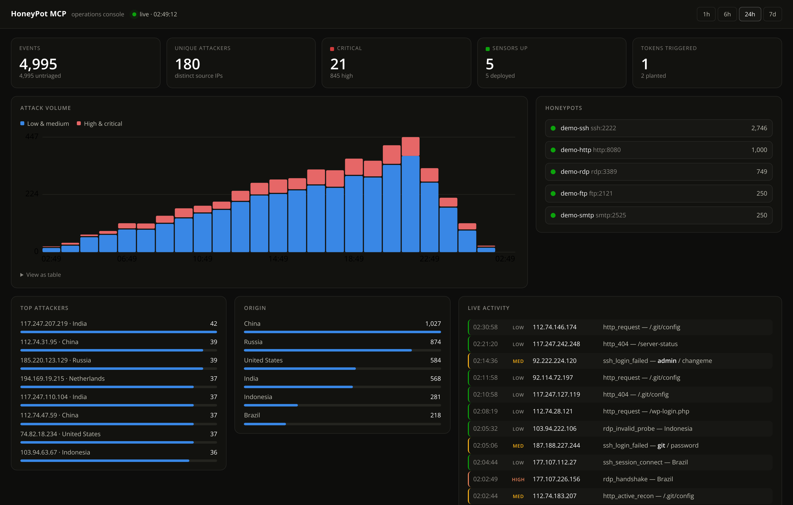
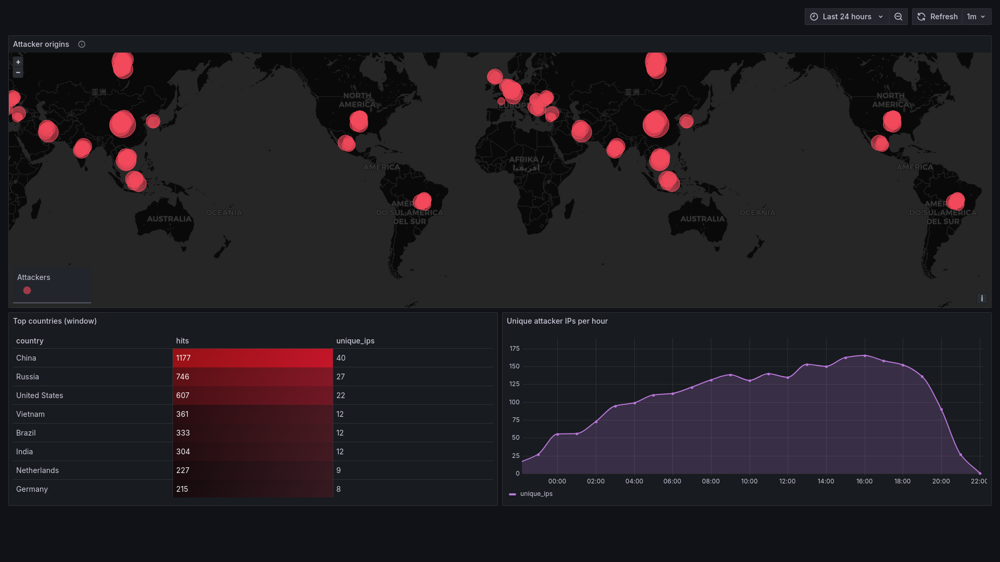
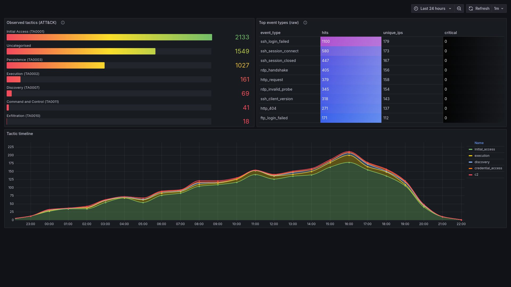
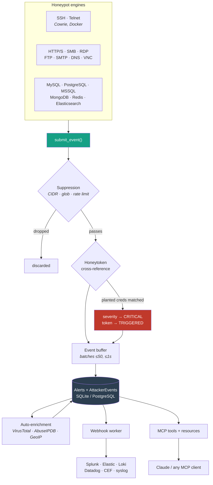

# HoneyPot MCP

[](https://github.com/tohudgins/HoneyPot-MCP/actions/workflows/ci.yml)
[](LICENSE)
[](pyproject.toml)
[](tests/unit)

**Deception infrastructure you drive by talking to it.** Deploy honeypots across 14
protocols, plant honeytokens, and analyse what attackers actually do — from a chat
window, a terminal, or a systemd unit.

```
> Deploy an SSH honeypot on port 2222 and an HTTP one on 8080.
> Anything critical in the last hour?
> Reconstruct what 45.148.10.72 did across all my honeypots.
> Export an iptables blocklist for anyone with 10+ hits.
```


<p align="center"><em>The built-in operations console — live attack feed, sensor health,
volume by severity. No login, no query language, no Grafana required.</em></p>

---

## Why this exists

Most honeypot stacks make you choose: a single-protocol toy you outgrow in a week,
or a 30-container distribution that takes a weekend to stand up and a spreadsheet to
operate. Both leave you reading raw JSON to answer "did anything interesting happen?"

HoneyPot MCP is the middle path. The engines capture real attack artifacts — the
attacker's SSH key from a Redis RCE dropper chain, the webshell body from a MySQL
`INTO OUTFILE`, the ransom note from a MongoDB wipe — and the analysis layer answers
questions in the language you'd actually ask them in. It runs on one box, installs in
two minutes, and speaks [Model Context Protocol](https://modelcontextprotocol.io) so
any MCP client (Claude Desktop, Claude Code, your own) becomes the console.

> **Before you rely on it:** [KNOWN_LIMITATIONS.md](KNOWN_LIMITATIONS.md) is a frank
> account of what works and what doesn't. It will catch internet-scale automated
> attack traffic. It will not fool a skilled human probing by hand.

---

## See it in 2 minutes

No API keys, no config, no MCP client required:

```bash
git clone https://github.com/tohudgins/HoneyPot-MCP.git
cd HoneyPot-MCP/docker
docker compose up -d --build

# Seed ~5,000 realistic attack events across the last 24h
docker compose exec honeypot-mcp python scripts/seed_demo_data.py

open http://localhost:3000        # Grafana — admin / honeypot
```

```
http://localhost:8090   ← the operations console (above)
http://localhost:3000   ← Grafana, for historical dashboards
```

That brings up the server, a live Cowrie SSH honeypot on `:2222`, an HTTP honeypot on
`:8080`, Prometheus, and three provisioned Grafana dashboards. The honeypots are real —
SSH into `localhost:2222` with any password and watch your own session appear in the
console within seconds.

<table>
<tr>
<td width="50%"><a href="docs/screenshots/threat-map.png"></a><br><em>Threat Map — geo-located attacker origins</em></td>
<td width="50%"><a href="docs/screenshots/mitre.png"></a><br><em>MITRE ATT&CK coverage by tactic</em></td>
</tr>
</table>

Screenshots are regenerated from the live stack by
[`scripts/capture_screenshots.sh`](scripts/capture_screenshots.sh) — not hand-captured,
so they can't drift from what the dashboards actually render.

---

## How it works

Engines never touch the database. Everything funnels through one ingestion path, which
is what makes suppression, honeytoken correlation, and SIEM fan-out uniform across all
14 protocols:



Three design decisions worth calling out:

- **Batched writes carry their own timestamps.** Every `PendingEvent` records when it
  happened, not when it was flushed. Without that, a batch of 50 events would share one
  `func.now()` and session reconstruction would be meaningless.
- **The webhook worker is decoupled from the flusher.** A SIEM endpoint that takes 30s
  to respond cannot back-pressure honeypot ingestion.
- **Enrichment is fire-and-forget and TTL-cached.** A CRITICAL alert triggers parallel
  VT/AbuseIPDB/GeoIP lookups that merge into the payload when they land. Repeat hits
  from the same IP cost zero external calls.
- **Tool responses are shaped for a context window.** A single HTTP alert can carry
  64 KB of captured body, so list tools return a digest of the fields you triage on,
  `alerts_get` expands one alert in full, and exports go to disk. Getting this wrong
  is how an MCP server becomes unusable on real traffic volume.

---

## Capabilities

<table>
<tr><td><b>14 protocols</b></td><td>SSH/Telnet (Cowrie), HTTP/S, SMB, RDP, FTP, SMTP, DNS, VNC, MySQL, PostgreSQL, MSSQL, MongoDB, Redis, Elasticsearch</td></tr>
<tr><td><b>Anti-fingerprinting</b></td><td>Per-deploy SSH + HTTP personas (coherent banner/kernel/header bundles), response jitter, per-honeypot self-signed TLS, realistic <code>robots.txt</code>/<code>favicon.ico</code>/<code>security.txt</code></td></tr>
<tr><td><b>Honeytokens</b></td><td>AWS/Azure/GCP keys, canary URLs, credential pairs, PDF/DOCX trackers, SSH keys, JWTs, DB rows, kubeconfigs, Slack webhooks</td></tr>
<tr><td><b>Credential correlation</b></td><td>Planted creds auto-match on any honeypot login and escalate to CRITICAL — including MySQL and VNC, where the plaintext never crosses the wire (the engine recomputes the scramble/DES response)</td></tr>
<tr><td><b>Analysis</b></td><td>MITRE ATT&CK mapping, attacker profiling + risk score, SSH session reconstruction, cross-honeypot kill-chain timelines, campaign correlation, XSS-safe HTML/Markdown reports</td></tr>
<tr><td><b>SIEM delivery</b></td><td>JSON (HMAC-signed), Splunk HEC, Elastic ECS, ArcSight CEF, RFC 5424 syslog, Grafana Loki, Datadog — per-subscription severity thresholds and delivery health stats</td></tr>
<tr><td><b>Response</b></td><td>Blocklist push to Cloudflare / pfSense / AWS WAFv2, iptables/fail2ban/CIDR export, STIX 2.1 bundles, AbuseIPDB reporting</td></tr>
<tr><td><b>Console</b></td><td>Built-in read-only web dashboard on <code>:8090</code> — live attack feed with captured credentials and paths, sensor health, volume by severity, top attackers and origins. Served by the server itself; no extra container</td></tr>
<tr><td><b>Triage</b></td><td>Bulk acknowledge by filter with a disposition (true/false positive, benign, duplicate), note and analyst; append-only audit log of every control-plane action</td></tr>
<tr><td><b>Operations</b></td><td>Health watchdog, restart reconciliation, retention sweep, per-IP connection caps, end-to-end self-test, Prometheus <code>/metrics</code>, Alembic migrations, JSON logging</td></tr>
</table>

404 unit tests cover the security-critical paths; ruff and mypy are blocking in CI
across Python 3.11–3.14.

---

## Install

**Prerequisites:** Python 3.11+, [uv](https://docs.astral.sh/uv/) (or pip). Docker only
if you want the Cowrie SSH honeypot.

```bash
git clone https://github.com/tohudgins/HoneyPot-MCP.git
cd HoneyPot-MCP
uv sync --extra dev          # or: pip install -e ".[dev]"
cp .env.example .env         # optional — everything works without keys
```

> `--extra dev` pulls in pytest/ruff/mypy. With a pip install, drop the `uv run` prefix
> from every command below.

**Optional integrations** — each degrades gracefully to `{"available": false}`:

| Variable | Gets you | Cost |
|---|---|---|
| `VIRUSTOTAL_API_KEY` | IP reputation | free |
| `ABUSEIPDB_API_KEY` | Abuse reports + outbound reporting | free, 1k/day |
| `GEOIP_DB_PATH` | Country/city/coords on every alert (City DB) | free, registration |
| `GEOIP_ASN_DB_PATH` | Origin AS number + org — spot hosting/VPN/botnet networks (ASN DB) | free, same account |
| `CANARY_PUBLIC_URL` | Honeytokens that fire from the internet | ngrok / a domain |

---

## Run it

There are three modes, and picking the right one is most of the setup:

| Mode | `MCP_TRANSPORT` | Lives as long as | Use for |
|---|---|---|---|
| **Local** | `stdio` (default) | the chat session | trying it out, development |
| **Daemon** | `http` | the systemd unit | real deployments driven by chat |
| **Collector** | `none` | the systemd unit | capture-only hosts, containers |

### Local (stdio)

Claude Code users: the repo ships `.claude/settings.json`, so the tools appear as soon
as you open it. For Claude Desktop, add to `claude_desktop_config.json` (macOS
`~/Library/Application Support/Claude/`, Windows `%APPDATA%\Claude\`):

```json
{
  "mcpServers": {
    "honeypot-mcp": {
      "command": "uv",
      "args": ["run", "--project", "/path/to/HoneyPot-MCP", "honeypot-mcp"],
      "cwd": "/path/to/HoneyPot-MCP"
    }
  }
}
```

Fully quit and relaunch Claude Desktop (tray → Quit, not just close-window), then:

```
Deploy an HTTP honeypot on port 8080, then run honeypot_self_test on it.
```

`alert_received: true` confirms the whole pipeline end to end — probe → engine →
suppression → buffer → database.

### Daemon (http)

Honeypots outlive any chat. This is the mode for anything real:

```bash
# In .env:  MCP_TRANSPORT=http   MCP_AUTH_TOKEN=$(openssl rand -hex 32)
sudo cp deploy/honeypot-mcp.service /etc/systemd/system/   # edit paths inside
sudo systemctl enable --now honeypot-mcp

# From your laptop — tunnel the control port, never firewall-expose it:
ssh -N -L 8000:127.0.0.1:8000 you@host &
claude mcp add --transport http honeypot-mcp http://127.0.0.1:8000/mcp \
  --header "Authorization: Bearer <your-MCP_AUTH_TOKEN>"
```

The networked control plane can deploy honeypots and read everything they capture, so
it is **fail-closed**: the server refuses to start on a networked transport unless
`MCP_AUTH_TOKEN` is set (or you explicitly opt out with `MCP_ALLOW_UNAUTHENTICATED`).

### Collector (none)

Runs the capture plane — engines, canary callbacks, watchdog, webhook delivery,
`/metrics` — with **no control plane at all**. Nothing can be deployed or queried
remotely; events flow to the database and onward to your SIEM. This is what the Docker
stack runs, and the right choice for a host that should collect attacks but never
accept commands.

---

## Deploy — catching real traffic

| Goal | Run it on | Effort |
|---|---|---|
| See the dashboards | your laptop | ~2 min (above) |
| Catch attacks on **your own network** | a spare box/VM | ~15 min |
| Catch **real internet attack traffic** | a $5 throwaway VPS | ~30 min ([docs/DEPLOY.md](docs/DEPLOY.md)) |

**Internal tripwire.** Put honeypots on ports nothing legitimate uses. Anything on your
LAN that connects is by definition not supposed to be — a compromised laptop sweeping
for open SSH/SMB/Redis, or someone poking around. **Every hit is high-signal.** Plant
credential tokens and canary URLs on real file shares so lateral movement trips them
too. Nothing needs to face the internet.

**Public internet.** Run the daemon on a VPS you don't care about and open 22, 80, 443,
445, 3389. Mirai SSH brute force, RDP/SMB exploit scanners, and web exploit probes
arrive within minutes. **Use a dedicated throwaway host, move your admin SSH off port 22
first, and never reuse production keys.** The guarded walkthrough — firewall rules,
alerting, ongoing ops — is in [docs/DEPLOY.md](docs/DEPLOY.md).

Already collecting? [`scripts/attack_report.py`](scripts/attack_report.py) turns a live
database into publishable campaign statistics:

```bash
uv run python scripts/attack_report.py --days 30 --format markdown
```

---

## MCP tools

<details>
<summary><b>Honeypots</b> — deploy, lifecycle, health</summary>

| Tool | Description |
|---|---|
| `honeypot_deploy` | Deploy any of the 14 engine types |
| `honeypot_list` / `honeypot_status` | List all / detail + recent events for one |
| `honeypot_stop` / `honeypot_pause` / `honeypot_resume` | Lifecycle control |
| `honeypot_configure` / `honeypot_clone` / `honeypot_logs` / `honeypot_templates` | Config, cloning, raw logs, profiles |
| `honeypot_health` | Probe ports/containers — catches silent deaths |
| `honeypot_self_test` | End-to-end pipeline check: synthetic probe → alert in DB |

</details>

<details>
<summary><b>Honeytokens</b> — generate, plant, track</summary>

| Tool | Description |
|---|---|
| `honeytoken_create` | Create any token type |
| `honeytoken_generate_aws` / `honeytoken_generate_credentials` | Fake AWS key pair / username-password sets |
| `honeytoken_embed_file` | PDF/DOCX with an embedded canary tracker |
| `honeytoken_list` / `honeytoken_status` / `honeytoken_revoke` / `honeytoken_export` | Manage and format for planting |

</details>

<details>
<summary><b>Alerts</b> — triage, search, export</summary>

| Tool | Description |
|---|---|
| `alerts_recent` | Triage by time window, severity, IP, or honeypot — returns a compact digest per alert |
| `alerts_get` | Full captured payload for one alert (headers, decoded bodies, enrichment) |
| `alerts_search` | Find alerts by payload content — a command, username, path, User-Agent, or hash |
| `alerts_stats` | Totals by severity, top attacker IPs, top event types, optionally windowed |
| `alerts_acknowledge` | Triage in bulk with a disposition (true/false positive, benign), note and analyst |
| `alerts_export` / `alerts_prune` | Write JSON/CSV to disk, retention |
| `audit_log_search` | Review every state-changing action the control plane took |

</details>

<details>
<summary><b>Analysis</b> — enrichment, profiling, reporting</summary>

| Tool | Description |
|---|---|
| `enrich_ip` | VirusTotal + AbuseIPDB + GeoIP, parallel and cached |
| `analyze_attacker` / `analyze_session` / `analyze_attacker_journey` | Profile + risk score / Cowrie session reconstruction / cross-honeypot ATT&CK timeline |
| `analyze_campaign` / `map_ttps` / `threat_timeline` | Campaign correlation, MITRE mapping, chronological timeline |
| `generate_report` | Write an XSS-safe HTML or Markdown report to disk |
| `export_blocklist` / `export_stix` | Write iptables/fail2ban/CIDR list or a STIX 2.1 bundle to disk |
| `report_ip_abuse` | Submit an attacker IP to AbuseIPDB |

</details>

<details>
<summary><b>Integrations</b> — SIEM, suppression, blocklist push</summary>

| Tool | Description |
|---|---|
| `alert_subscribe` / `alert_unsubscribe` / `alert_subscriptions_list` | SIEM/webhook delivery with health stats |
| `suppression_add` / `suppression_remove` / `suppression_list` | Drop or rate-limit noise (exact IP / CIDR / event-type glob) |
| `suppression_load_preset` / `suppression_list_presets` | Bundled presets: shodan, censys, internal-rfc1918 |
| `blocklist_push_cloudflare` / `blocklist_push_pfsense` / `blocklist_push_aws_waf` | Push offenders to live appliances (idempotent, `dry_run`) |

</details>

**MCP resources:** `honeypot://active` · `alerts://stream` · `honeytoken://triggered` · `stats://dashboard`

---

## SIEM integration

`alert_subscribe(url=..., format=...)` picks the body shape and auth scheme. The
`hmac_secret` field carries whatever credential that format needs:

| `format` | Body | `hmac_secret` is… |
|---|---|---|
| `json` (default) | native JSON envelope | HMAC key → `X-HoneyPot-Signature` |
| `splunk_hec` | HEC `{time, host, sourcetype, event}` | HEC token → `Authorization: Splunk` |
| `elastic_ecs` | ECS document, raw payload in `event.original` | API key → `Authorization: ApiKey` |
| `cef` | ArcSight CEF line (QRadar-compatible) | — |
| `syslog` | RFC 5424; `udp://host:514` or `tcp://host:514` | — |
| `loki` | Loki push API, stringified-ns timestamps | `base64(userid:token)` → `Basic` |
| `datadog` | Logs API v2 list | API key → `DD-API-KEY` |

```text
> alert_subscribe(
    url="https://splunk.example.com:8088/services/collector/event",
    label="splunk-prod", severity_threshold="medium",
    hmac_secret="<your-HEC-token>", format="splunk_hec"
  )
```

For Slack / Discord / PagerDuty / SOAR, use the default `json` format — passing
`hmac_secret=""` generates and returns a 32-byte signing secret. Check delivery health
any time with `alert_subscriptions_list`.

---

## Cloud honeytokens (optional)

Generated AWS/Azure/GCP credentials only fire if your cloud audit logs reach the canary
server's HMAC-signed `/cloud-event` endpoint. Ready-to-deploy forwarders ship under
[`examples/cloud-forwarders/`](examples/cloud-forwarders/) — AWS (Lambda + Terraform +
EventBridge), Azure (Function App + Bicep), GCP (Cloud Function + Log Sink).

```bash
# .env
CLOUD_EVENT_HMAC_SECRET=$(openssl rand -hex 32)
```

Without a forwarder these are believable decoys with no callback. Said plainly in
[KNOWN_LIMITATIONS.md](KNOWN_LIMITATIONS.md).

---

## Development

```bash
uv run pytest tests/unit/ -v     # 404 tests
uv run ruff check src/ tests/
uv run mypy src/
```

Schema changes are Alembic-managed and apply at startup:

```bash
uv run alembic revision --autogenerate -m "what changed"   # review before committing
```

```
src/honeypot_mcp/
├── server.py            — FastMCP app, lifespan, transports, MCP resources
├── canary.py            — Callback server: canary URLs, PDF trackers, /cloud-event
├── webhooks.py          — Outbound SIEM delivery worker (HMAC, retries)
├── suppression.py       — Drop / rate-limit rule engine
├── credential_match.py  — Planted-credential cross-reference (auto-CRITICAL)
├── credential_verify.py — Hashed-auth verification (MySQL scramble, VNC DES)
├── watchdog.py          — Health checks + opt-in retention sweep
├── reconcile.py         — Re-establishes RUNNING honeypots after a restart
├── engines/             — Honeypot engines (plugin ABC: HoneypotEngine)
├── tokens/              — Honeytoken providers (plugin ABC: HoneytokenProvider)
├── storage/             — Models, async DB layer, batched event buffer
├── intel/               — VirusTotal, AbuseIPDB, GeoIP, MITRE (TTL-cached)
├── analysis/            — Correlator, profiler, Jinja2 reporter
└── tools/               — MCP tool modules
```

Adding an engine or token type is a subclass plus one line in a registry —
[CLAUDE.md](CLAUDE.md) documents both plugin patterns along with the event pipeline and
persona systems.

---

## What this is and isn't

**Good fit:** SOC research and training labs, internal tripwire deception, small-to-medium
alert pipelines, and collecting internet-scale automated attack traffic on a public IP.

**Not a fit without more work:** fooling a skilled human probing by hand. SSH is Cowrie
and genuinely high-fidelity; the custom protocol engines are detection-focused facades,
so an expert can eventually fingerprint them. For maximal fidelity across more protocols
see [T-Pot](https://github.com/telekom-security/tpotce),
[OpenCanary](https://github.com/thinkst/opencanary), or
[Thinkst Canary](https://canary.tools/).

The full rundown is in [KNOWN_LIMITATIONS.md](KNOWN_LIMITATIONS.md).

---

## License

[MIT](LICENSE).
